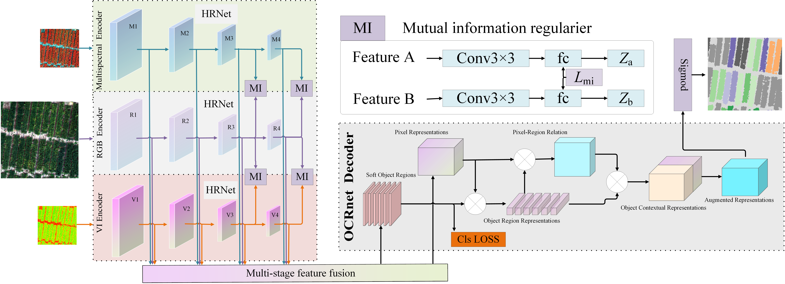

# RustQNet，a DL-based quantitative architecture for multimodal image, designed for pixel-level quantitative inversion of wheat stripe rust (WSR) disease index (DI)

## This site is still under construction....

Code for paper: **Accurate and Large-scale Quantitative Inversion of Wheat Stripe Rust Disease Index: A Novel Multimodal UAV Dataset and Deep Learning Benchmark [[Arxiv]](https://scholar.google.com.hk/citations?user=mfrNGLoAAAAJ&hl=zh-CN)**

## 1 Overview

      
    <em> 
   Figure 1: Overview of RustQNet. RustQNet architecture is designed for intelligent interpretation of multi-modal remote sensing data. In this architecture, the RGB modality exhibits high spatial resolution characteristics, while the MS and VI modalities possess high spectral resolution characteristics. The abbreviation "MI" refers to the mutual information minimization module, "Conv3×3" represents a 3×3 convolutional layer, and "fc" represents a fully connected layer.
    </em>

### Usage

1. Requirements
   
   - Python 3.9
   - PyTorch 1.12.1
   - Cuda 11.8
2. Dataset structure
   

      
    <em> 
    Figure 2: structure of Dataset. 
    </em>

      
    <em> 
    Figure 3: structure of Dataset. 
    </em>

